# The JWE Proxy

In more and more contextes, the confidentiality of HTTPS exchanges cannot really be trusted.

Many companies deploy proxies and root certificates to their employees' devices without them knowing. Sometimes a whole country internet provider is doing it. In addition, certificates and root certificates can be stolen, or corrupted certificate authorities can sell invalid certificates to allow spying on targetted users.  

A non-perfect mechanism to improve the situation named [HTTP Public Key Pinning](https://en.wikipedia.org/wiki/HTTP_Public_Key_Pinning) has been used for a little while and then removed from web browsers.

In 2020 we don't have a clear standard solution for this problem. Therefore we implement a new layer of encryption of the data exchanges, on top of HTTPS, using JWE (JSON Web Encryption).

However due to technical constraints, we don't have a chain of trust and someone targetting Norgance could build a different version sending the data trough a third-party server. We plan to sign the frontend with PGP but it will be a manual operation that virtually all users will not do.

So this clearly overengineered tentative to improve privacy as art. It will help to protect privacy when a system is spying on all websites, but it will not do much a targetted attack on a specific user using Norgance, except slightly increasing the human cost of such an attack.

## How will it work

```mermaid
sequenceDiagram
    Client->>+PublicKeyServer: What is the Api server public key ? (TLS)
    PublicKeyServer->>-Client: This is the public key (TLS)

    Client->>+ApiServer: Query and random symmetric key for response (JWE encrypted with public key)
    ApiServer->>-Client: Response (JWE encrypted with the symmetric key)
```

